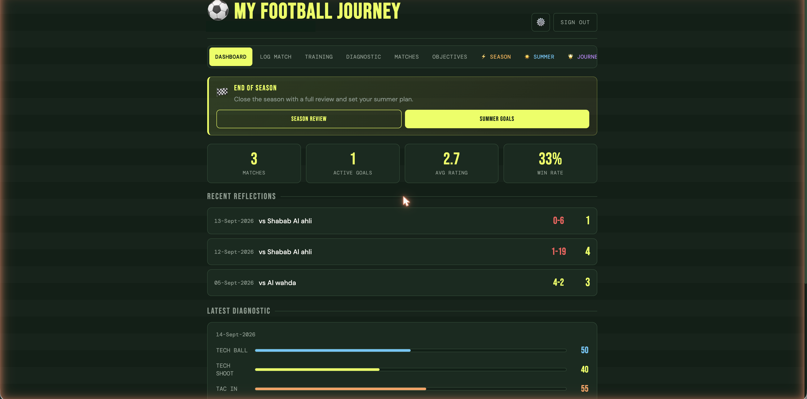
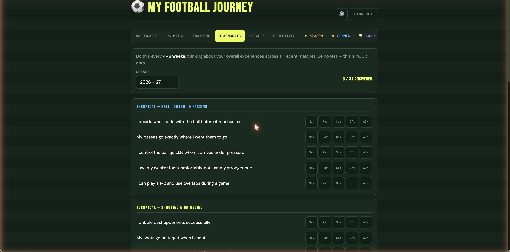
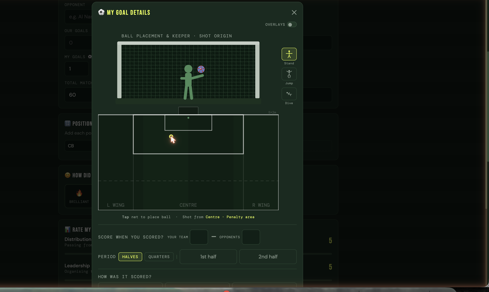
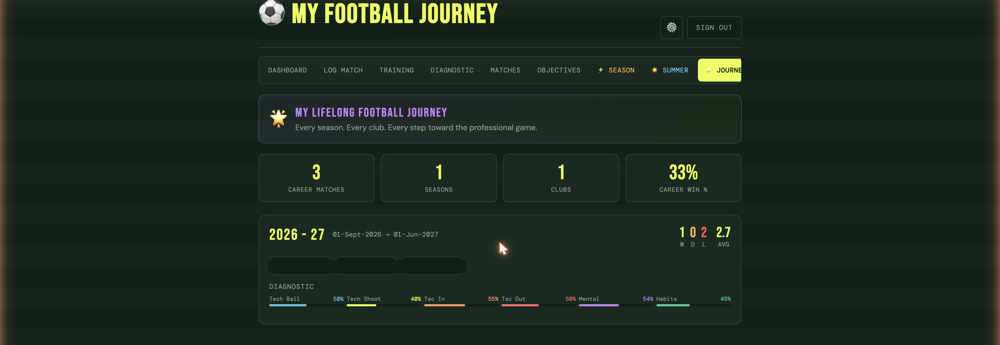

# Football Journal


-3ECF8E)


## Table of contents
- [What it is](#what-it-is)
- [Screenshots](#screenshots)
- [Core features](#core-features)
- [Real examples](#real-examples)
- [Tech stack](#tech-stack)
- [The AI coach — grounded in what the player actually wrote](#the-ai-coach--grounded-in-what-the-player-actually-wrote)
- [Data model](#data-model)
- [Running locally](#running-locally)
- [License](#license)

## What it is

Football Journal is a **longitudinal player-development platform** for youth footballers — a player-owned record of matches, training, and self-reflection that travels with a player across seasons and clubs, rather than living in a coach's private notebook or disappearing when a season ends. Every match gets logged with real position data, ratings, and a written reflection; an AI coach reads that reflection back and responds in a real coaching voice, not generic praise.

## Screenshots

**Dashboard** — season snapshot: matches played, active goals, average rating, win rate, recent match results, and the latest self-diagnostic at a glance.


**Diagnostic** — a 31-question self-assessment across 6 real development categories (Technical, Tactical in/out of possession, Mental, Development habits), meant to be re-taken every 4–6 weeks to track real trendlines, not a one-off form.


**Goal details** — click-to-place shot diagram: where the ball crossed the line, where the keeper was standing (and whether they were standing, jumping, or diving), and what part of the pitch the shot came from — captured per goal, not just a tally.


**My Journey** — the career-spanning view: every season, every club, real win/draw/loss record, and diagnostic trendlines rolled up across a player's whole history, not just the current season.


## Core features

- **Match reflection, not just a scoresheet** — every match records position(s) played (with time ranges, if a player switched roles mid-game), a performance self-rating across multiple dimensions, mood, and free-text reflection on what went well and what to improve.
- **Goal-by-goal shot mapping** — a real click-to-place diagram captures exactly where each goal was scored from and where the keeper was positioned, not just a goals-scored counter.
- **AI coach feedback** — after logging a match, season, or summer plan, an AI coach (Google Gemini) responds in a real football-coaching voice, grounded in what the player actually wrote — not a templated "great job!" message.
- **AI-suggested reflection chips** — a word-cloud of contextual, position-aware suggestions (e.g. "won the ball back quickly" for a defender after a loss) speeds up writing a reflection without ever writing it for the player.
- **Recurring self-diagnostic** — 31 questions across 6 categories, designed to be retaken every 4–6 weeks so a player can see real trends, not a single static self-assessment.
- **Season review and summer planning** — structured end-of-season reflection and a summer training plan, both with their own AI feedback pass.
- **Multi-role access** — Player, Parent, and Coach roles, so a parent can add their own observations and a coach can be invited in without either one controlling the player's own record.
- **Career-spanning Journey view** — every season and club a player has been part of, rolled into one continuous history instead of resetting each year.

## Real examples

The AI feedback is grounded in the player's own input, not generic sports-app copy. Two real examples from the actual prompts sent to Gemini:

| What the player logs | What the AI coach actually says |
|---|---|
| A match reflection: opponent, result, position, performance ratings, "what went well," "what to improve," and a key moment | The system prompt explicitly instructs: *"Give 3-4 sentences of coach-voice feedback... Acknowledge what went well, address the improvement area, and leave them with something concrete to work on. Do not use bullet points or headers — just flowing coach voice."* — the response is written to read like a real coach, not a report. |
| A post-match reflection form, before the player has written anything | The chip-suggestion endpoint builds position- and result-aware suggestions on the fly — e.g. improvement chips are deliberately weighted toward defensive/mental categories after a loss, not the same generic list regardless of outcome. |
| A goal logged in the match form | Opens a dedicated modal: tap the net to place exactly where the ball crossed the line, tap the pitch to mark where the shot came from, drag the keeper's position and posture (stand/jump/dive) — stored per goal, not summarized into a single number. |
| A player's self-diagnostic, retaken 4–6 weeks later | Each of the 6 categories (e.g. "Technical — Shooting & Dribbling," "Tactical — Out of Possession") tracks its own score over time on the Dashboard and Journey views, so a specific weak area is visible as a trend, not buried in an overall average. |

## Tech stack

- **Frontend**: Next.js 14 (App Router) + TypeScript + Tailwind CSS
- **Backend / data**: Supabase (Postgres + Auth + Row Level Security), Supabase Storage for photos/logos
- **AI**: Google Gemini 2.5 Flash, called via Google's OpenAI-compatible endpoint (no extra SDK) — server-side only, key never exposed to the client
- **Rich text**: Tiptap, with @mentions support for tagging teammates in reflections
- **Hosting**: Vercel

## The AI coach — grounded in what the player actually wrote

Every AI feature in this app shares one small helper (`src/lib/utils/gemini.ts`) that calls Gemini's OpenAI-compatible endpoint directly — no SDK dependency, no server-side framework beyond a plain `fetch`. What varies per feature is the prompt, and every prompt is built from the player's actual structured input (opponent, result, position, numeric ratings) plus their own free-text reflection, not a static template with blanks filled in. The system prompt is explicit about *voice*, not just content — "growth-mindset, football-literate, warm but honest," using real football terminology because "the player has high football IQ," and deliberately avoiding bullet points so the output reads like something a coach would actually say out loud, not a generated report.

## Data model

22 tables in Supabase Postgres, RLS-scoped per user. The shape roughly splits into:

- **People & access**: `users`, `player_profiles`, `parent_links`, `coach_access`, `parent_observations`
- **Career structure**: `seasons`, `clubs`, `teams`, `teammates`, `competitions`
- **Match data**: `matches`, `match_positions`, `match_ratings`, `match_video_moments`
- **Training & reflection**: `training_sessions`, `reflections`, `reflection_mentions`, `diagnostics`
- **Goals & planning**: `goals`, `season_reviews`, `summer_plans`
- **Media**: `player_photos`

## Running locally

<details>
<summary>Setup steps (click to expand)</summary>

```bash
npm install
cp .env.example .env.local   # fill in your own Supabase project + Gemini API key
npm run dev
```

Open `http://localhost:3000`.

The Supabase schema (22 tables, RLS policies included) lives in `supabase/migrations/` — apply them in order against your own Supabase project (via the Supabase CLI or dashboard) before the app will have anything to read or write.

</details>

## License

MIT — see [LICENSE](LICENSE).
